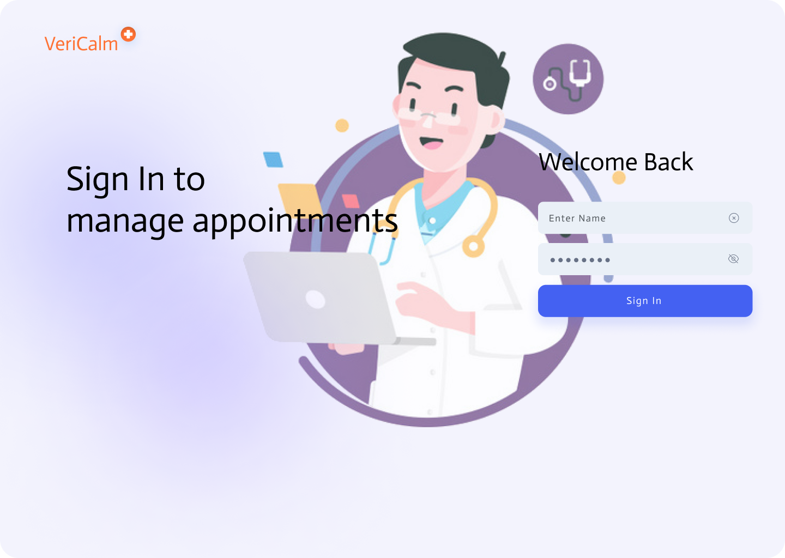
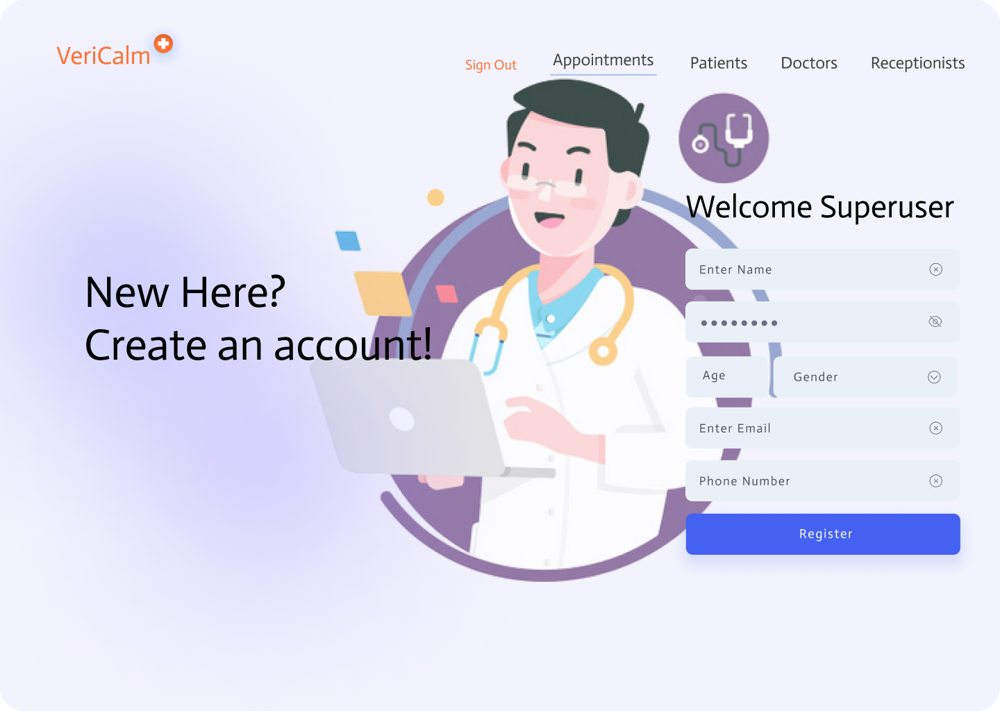
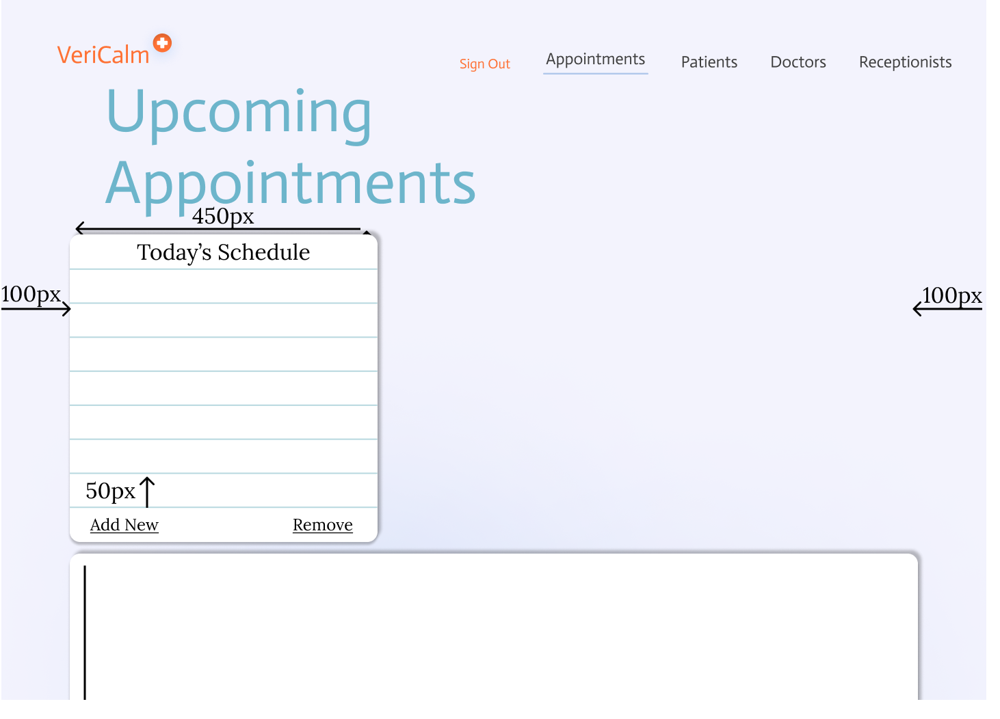
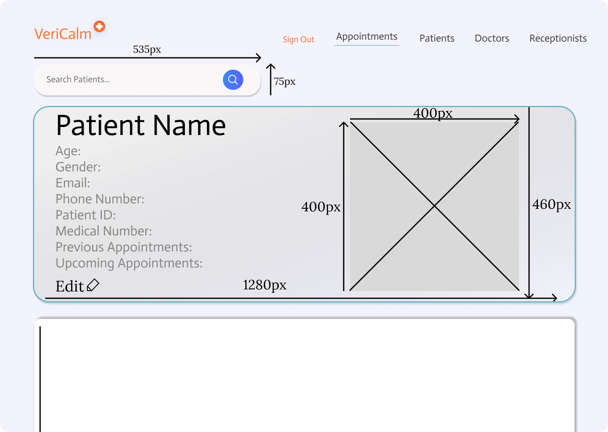
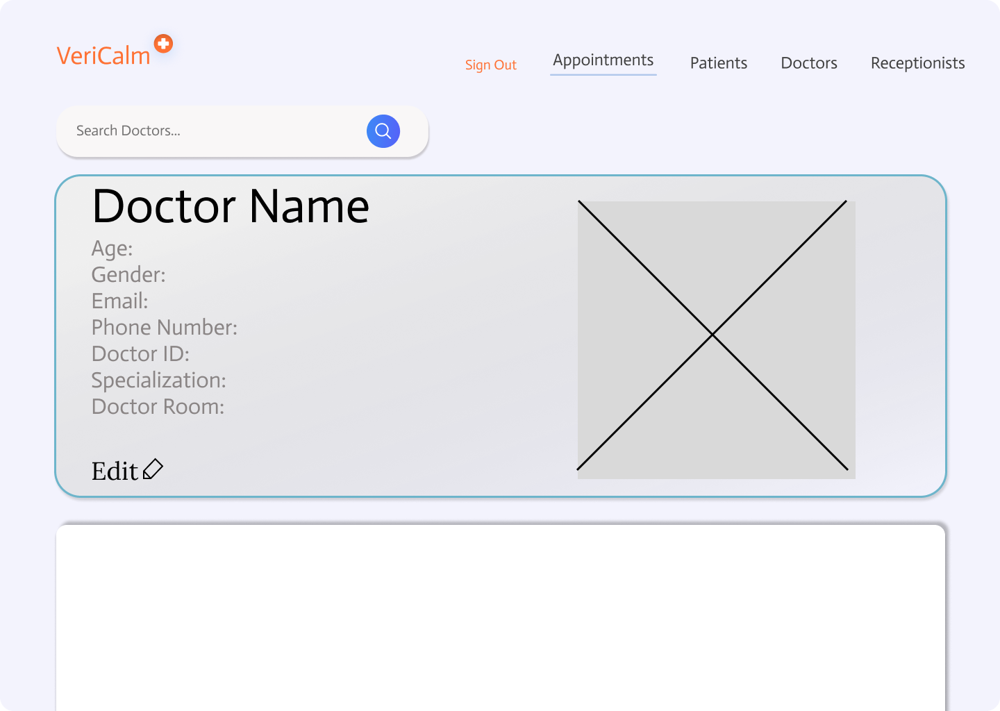
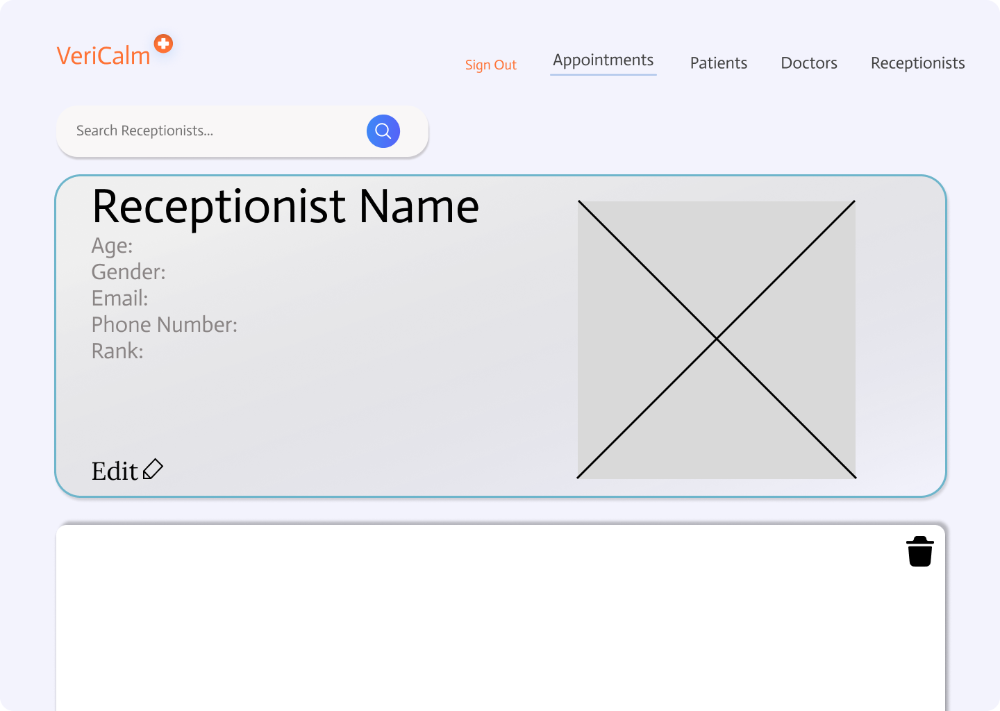

<!-- Project Info -->
<br>


<!-- Logo and link to repository -->
<p align="center">
  <a href="https://github.com/Pantonym/DV200_Term2">
    
  </a>
</p>

<!-- Short Description -->
<h3 align="center">VeriCalm: Medical Management Portal Desktop Application</h3>
<p align="center"> This is a database management portal for a medical office, where receptionists can manage appointments, patients, doctors and their own profiles.
    <br>
    <!-- Bug and New Feature Links -->
    <a href="https://github.com/Pantonym/DV200_Term2/issues">Report Bug</a>
    <a href="https://github.com/Pantonym/DV200_Term2/issues">Request Feature</a>
    <br>
</p>

<!-- Name, Number, Subject and Term -->
<h5 align="center" style="padding:0;margin:0;">Nico van Wyk</h5>
<h5 align="center" style="padding:0;margin:0;">Student Number: 221179</h5>
<h6 align="center">DV200 | Term 2</h6>

<!-- TABLE OF CONTENTS -->
## Table of Contents

- [Table of Contents](#table-of-contents)
- [About the Project](#about-the-project)
  - [Mockup](#mockup)
  - [Project Description](#project-description)
    - [Technologies Used](#technologies-used)
  - [Built With](#built-with)
    - [PHP](#php)
    - [MySQL](#mysql)
    - [XAMPP](#xampp)
    - [Bootstrap](#bootstrap)
- [Getting Started](#getting-started)
  - [Prerequisites](#prerequisites)
  - [Installation](#installation)
- [Features and Functionality](#features-and-functionality)
- [Development Process](#development-process)
  - [Architecture](#architecture)
  - [Design Frame](#design-frame)
  - [Solution](#solution)
  - [Theme](#theme)
  - [What was refined?](#what-was-refined)
  - [Development Documents](#development-documents)
  - [Highlights](#highlights)
  - [Challenges](#challenges)
  - [Future Implementation](#future-implementation)
- [Final Outcome](#final-outcome)
  - [Mockups](#mockups)
  - [Video Demonstration](#video-demonstration)
- [License](#license)
- [Author](#author)
- [Contact](#contact)
- [Acknowledgements](#acknowledgements)
- [References](#references)

<!-- About the Project -->
## About the Project

### Mockup


<!--PROJECT DESCRIPTION-->
### Project Description
VeriCalm is a medical database management portal that allows receptionists to add, update and delete doctor profiles, patient profiles and their own profiles. They can also add, delete and update appointments. The Head Receptionist is the SuperUser, and can therefore edit any entity in the database, whereas Receptionists can only edit their own profiles and the appointments. 
#### Technologies Used
* PHP
* MySql
* Xampp
* Figma 
* Bootstrap

### Built With
<!-- PHP -->
#### PHP
* General-Purpose scripting language.
* Used to implement the front end of the application, as well as the logic to translate the back end into the front end.
<p>PHP was used to build the application's front end and back end logic.</p>


<!-- MySQL -->
#### MySQL
* My Structured Query Language is a relational database management system (DBMS).
* Used to implement the back end of the application.
<p>MySQL was used to build the application's back end logic regarding communicating with the database.</p>


<!-- XAMPP -->
#### XAMPP
* Created by Apache, XAMPP is used to test the PHP application without purchasing a dedicated server.
* Used to implement the back end of the application, test the MySQL database, and test hosting for the website.
<p>XAMPP was used to create a local server to test the application and host the database.</p>


<!-- Bootstrap -->
#### Bootstrap
* Provides CSS frameworks for the implementation of responsive user experience designs.
* Used to implement the front end of the application.
<p>Bootstrap implemented the requirements of having a responsive, professional design.</p>


<!-- GETTING STARTED -->
## Getting Started
These instructions will get you a copy of the project up and running on your local machine for development and testing purposes.

### Prerequisites
For development and testing, the latest version of XAMPP is required. The latest version can be downloaded from [Apache Friends](https://www.apachefriends.org/download.html)

### Installation
Here are a couple of ways to clone this repo:

1.  GitHub Desktop </br>
    Enter `https://github.com/Pantonym/DV200_Term2.git` into the URL field and press the `Clone` button.

2.  Clone Repository </br>
    Run the following in the command-line to clone the project:

    ```sh
    git clone https://github.com/Pantonym/DV200_Term2.git
    ```

<!-- Main Features and Functionality -->
## Features and Functionality
1. Log in and Register Page - Log in with a registered user
* The SignIn.php action would be called from the Index.php Page. Here is a snippet of how the sign in process is followed:
`while ($row = $result->fetch_assoc()) {`
`  // --If the name is correct`
`  if ($row['Name'] == $Username) {`
`    // ----The name has been found. This will be used for error message generation`
`    $bFoundName = true;`
`    // ----Collect the encrypted password from the database (It has been encrypted using password_hash() during receptionist update/creation)`
`    $Password_Hash = $row['Password'];`
`    // ----Verify the encrypted password with the one the user submitted using the password_verify() function`
`    $verification_result = password_verify($Password, $Password_Hash);`
`      // --If the password is correct`
`      if ($verification_result == true) {`
`      // ----The password has been found.`
`      $bFoundPass = true;`
`      // ----Store session variables`
`      $_SESSION["UserType"] = $row['Rank'];`
`      $_SESSION["ID"] = $row['RecepID'];`
`      break;`
`      // --If the password is incorrect`
`  } else {`
`    $bFoundPass = false;`
`    break;}`
`  // ----If no matching User is found`
`} else {$bFoundName = false;}}`

2. Log in and Register Page - Create and register a new user
* A single action page, create.php, handles all creation requests. From the register.php page the create.php page knows it only needs to handle _user_ creation. Here is how the user entry is created:
`if ($db == "receptionist") {`
`  // --Receptionist Add`
`  $name = $_POST["name"];`
`  $surname = $_POST["surname"];`
`  $age = $_POST["age"];`
`  $gender = $_POST["gender"];`
`  $phonenum = $_POST["phonenum"];`
`  $email = $_POST["email"];`
`  $password = $_POST["password"];`
`  $rank = $_POST["rank"];`
`  // --Create a secure password from the supplied password`
`  $password_hash = password_hash($password, PASSWORD_DEFAULT);`
`  // --sql query:`
`  $sql = "INSERT INTO receptionist (RecepID, ProfileImg, Name, Surname, Age, Gender, PhoneNumber, Email, Password, Rank, SignedIn) `
`  VALUES('','http','$name','$surname','$age','$gender','$phonenum','$email','$password_hash','$rank', '0')";`
`  $conn->query($sql);`
`  // --Return to the receptionists page`
`  $header = "../receptionists.php";`
`} else if ...`

3. Landing Page - Show a list of upcoming appointments
* On the appointments.php page, the dayplan_populate.php component is called to show a list of upcoming appointments. The user can also change the date on a calendar next to the dayplan, which is why the snippet starts with an if statement to see if the session variable "date" is set.
`if (isset($_GET['date'])) {`
`  // Collect the selected date from the header`
`  $date = $_GET['date'];`
`  // Build the SQL to get all appointments for this date`
`  $sql = "SELECT * FROM appointments WHERE AppointmentDate= '$date'";`
`  $result = $conn->query($sql);`
`  // Header (displays the current date)`
`  echo '`
`  <div id="dayplan_header">`
`    <h1 style="width: 450px; text-align: center; padding-top: 3.5%; color: white;"> ' . $date . ' </h1>`
`  </div>';`
`...`

4. Landing Page - Show uniform navigation across the whole portal
* the footer.php component is used to have a uniform footer on each page. The navbar is also uniform across each page, but to have increased design elements, had to be created on each page separately so that teh currently active page could be highlighted.
* Navbar:
`<nav class="navbar navbar-expand-sm bg-none navbar-light">`
`  <div class="container-fluid">`
`    <a class="navbar-brand" href="appointments.php" style="margin-left: 50px; margin-top: -10px;">`
`      `
`    </a>`
`    <ul class="navbar-nav" style="margin-right: 100px; padding-top: 15px;">`
`      <li class="nav-item" style="padding-top: 5px;">`
`        <a class="nav-link nav_sign_out" href="actions/signout.php">Sign Out</a>`
`      </li>`
`      ...`
`    </ul>`
`  </div>`
`</nav>`
* Footer:
`<?php`
`// This footer is called on each relevant page. The navbar is not a component because the underlined nav link changes on each page.`
`echo '<div class="container">';`
`echo '<div class="row" style="margin-left: 5%;">';`
`echo '<div class="col">';`
`echo '';`
`echo '<p style="color: #6F6C90; margin-top: 30px; font-size: 22px;">Medical Management Portal</p>';`
`echo '';`
`echo '</div>';`
`...`
`?>`

5. Landing Page - Create an appointment
* Through the populated dayplan on the landing page, the user can move to the appointmentNew.php page. This page holds the inputs to create the new appointment, and when they are submitted it calls the create.php action page. When the appointment is created, the user is sent back to the landing page to view it.
`else if ($db == "appointment") {`
`  // --Appointment Add`
`  $doctor = $_POST['app_doctor'];`
`  $patient = $_POST['app_patient'];`
`  // --convert the date to the correct sql format`
`  $input_date = $_POST['app_date'];`
`  $date = date("Y-m-d H:i:s", strtotime($input_date));`
`  // --Find the receptionist that added this appointment`
`  $receptionist = $_SESSION["ID"];`
`  $sqlDR = "SELECT DoctorRoom FROM doctors WHERE DoctorID = $doctor";`
`  $resultDR = $conn->query($sqlDR);`
`  while ($rowDR = $resultDR->fetch_assoc()) {$app_room = $rowDR['DoctorRoom'];}`
`  // --sql query:`
`  $sql = "INSERT INTO appointments (AppointmentID, DoctorID, PatientID, RecepID, DoctorRoom, AppointmentDate) `
`  VALUES ('','$doctor','$patient','$receptionist','$app_room','$date')";`
`  $conn->query($sql);`
`  // --Return to the appointments page`
`  $header = "../appointments.php";`
`}`

6. Patients Page - Show a list of all registered patients
* On the patients.php page, the patients_populate.php component is called to display all registered patients. The component first tests to see if the user that is logged in is the administrator, and if they are the application displays the relevant CRUD buttons.
`if ($SuperUser_Global == true) {`
`  echo '<tr>';`
`  echo '<th class="th_all_table">Name</th>';`
`  echo '<th class="th_all_table">ID</th>';`
`  echo '<th class="th_all_table">Medical Aid Number</th>';`
`  echo '<th class="th_all_table">Email</th>';`
`  echo '<th class="th_all_table">Upcoming Appointments: </th>';`
`  echo '<th class="th_all_table" style="border-right: 0px;"><a href="patientRegister.php" role="button">ADD NEW</a></th>';`
`  echo '</tr>';`
`  while ($row = $result->fetch_assoc()) {`
`    echo '<tr>';`
`    echo '<td style="color: #0098c7;"> <a href="patients.php?id=' . $row['PatientID'] . '">' . $row['Name'] . ' ' . $row['Surname'] . '</a></td>';`
`    echo '<td>' . $row['PatientID'] . '</td>';`
`    echo '<td>' . $row['MedicalAidNumber'] . '</td>';`
`    echo '<td>' . $row['Email'] . '</td>';`
`    echo '<td>' . $row['PrevAppointments'] . '</td>';`
`    echo '<td style="border-right: 0px;"><a class="btn btn-danger" href="actions/delete.php?id=' . $row['PatientID'] . '&page=patient" role="button">Delete</a></td>';`
`    echo '<tr>';`
`  }} else if ($SuperUser_Global == false) {...}`

7. Individual Patient Page - Show all details of a patient as described in the brief
* The individual patient information is displayed at the top of the patients page so the receptionist would not need to go to a different page to see patient information. When the user selects a patient, the patients_selected.php component is updated with the new information.
`$sql = "SELECT * FROM patients WHERE PatientID = $id";`
`  $header_return = '../patients.php';`
`  $result = $conn->query($sql);`
`  while ($row = $result->fetch_assoc()) {`
`    $Selected_Name = $row["Name"];`
`    $Selected_Surname = $row["Surname"];`
`    $Selected_Age = $row["Age"];`
`    $Selected_Gender = $row["Gender"];`
`    $Selected_PhoneNumber = $row["PhoneNumber"];`
`    $Selected_Email = $row["Email"];`
`    $Selected_Pass = $row["Password"];`
`    $Selected_ID = $row["PatientID"];`
`    $Selected_MedNum = $row["MedicalAidNumber"];`
`    $Selected_PrevApp = $row["PrevAppointments"];`
`    $Selected_Img = $row["ProfileImg"];`
`    echo ...`
`}`

8. Patients Page - Create, Update, Delete a patient
* The CRUD functionality is handled through the patients_selected.php component. The `<p>` tags are replaced by `<input>` tags, and the information is sent to the relevant action page (create.php, update.php, delete.php):
`if ($_GET['update'] == 'true') {`
`  $sql = "SELECT * FROM patients WHERE PatientID = $id";`
`  $header_return = '../patients.php';`
`  $result = $conn->query($sql);`
`  while ($row = $result->fetch_assoc()) {`
`    $Selected_Name = $row["Name"];`
`    ...`
`  }`
`  echo '<form method="post" action="actions/update.php?db=patient&id=' . $Selected_ID . '">';`
`  echo '<div style="float: left;">';`
`  echo '<ul class="selected_ul">';`
`  echo '<li style="font-size: 28px;" id="patient_age" class="selected_li">Name: <input type="text" name="name" value="' . $Selected_Name . '"></li>';`
`  ...`

9. Doctor's Page - Show a list of created doctors
* The doctors page populates in the same way the patients page does.

10. Individual Doctor Page - Show all details of a doctor as described in the brief
* The individual doctor information is displayed in the same way the individual patient information is.

11. Doctor's Page - Create, Update Delete a doctor 
* Doctor CRUD functionality is handled in the same way patient CRUD functionality is.

12. Individual appointment - Show all details of an appointment and update them
* The individual appointment data is shown in the dayplan, and when the update button is clicked, the user is taken to the appointments_change.php component.
`while ($rowSt = $resultSt->fetch_assoc()) {`
`  // --The starting values of the appointment. This is used to tell the user what is being changed.`
`  $patientSt = $rowSt['PatientID'];`
`  $doctorSt = $rowSt['DoctorID'];`
`  $recepSt = $rowSt['RecepID'];`
`  $dateSt = $rowSt['AppointmentDate'];}`
* Update.php is called:
`if ($db == "appointment") {`
`  // --Collect inputs from the user`
`  $doctor = $_POST['app_doctor'];`
`  $patient = $_POST['app_patient'];`
`  $appID = $_POST['appID'];`
`  // --convert the date to the correct sql format`
`  $input_date = $_POST['app_new_date'];`
`  $date = date("Y-m-d H:i:s", strtotime($input_date));`
`  // --Find the receptionist that changed this appointment`
`  $sqlR = "SELECT RecepID FROM receptionist WHERE SignedIn = '1'";`
`  $resultR = $conn->query($sqlR);`
`  while ($rowR = $resultR->fetch_assoc()) {`
`    $receptionist = $rowR['RecepID'];}`
`  // --Find the doctor room of the doctor that was chosen`
`  $sqlDR = "SELECT DoctorRoom FROM doctors WHERE DoctorID = $doctor";`
`  $resultDR = $conn->query($sqlDR);`
`  while ($rowDR = $resultDR->fetch_assoc()) {`
`    $app_room = $rowDR['DoctorRoom'];}`
`  // --sql query:`
`  $sql = "UPDATE appointments SET DoctorID = '$doctor', PatientID = '$patient', RecepID = '$receptionist',`
`  DoctorRoom = '$app_room', AppointmentDate = '$date' `
`  WHERE AppointmentID = $appID";`
`  $conn->query($sql);`
`  $header = "../appointments.php";`
`}`

13.  Additional features and functionality
* Password Hashing is completed through the password_hash() function
`  // --Create a secure password from the supplied password`
`  $password_hash = password_hash($password, PASSWORD_DEFAULT);`

<!-- Development PROCESS -->
## Development Process
### Architecture
The application consists of multiple php pages, components and actions.
### Design Frame
How might we create a solution to the problem of needing an application to manage a relational database used for managing the appointments of a medical office?
### Solution
The VeriCalm application, which can Create, Read, Update and Delete (CRUD) entries in a MySQL Database for appointments, as well as doctor, patient and receptionist profiles.
### Theme
I chose a simple and easy-to-understand design because the management portal controls appointments that are directly related to someone's wellbeing. Excessive styling would only distract from the purpose of the portal: medical appointments that are highly important. I used a very light purple as my background colour to give the text better visibility, as well as to compliment the orange used in the logo. It also adds to the light blue I used as my secondary colour, with my main colour being white  to add to the 'medical' feel I wanted to emulate. I included a lot of self study in this project, such as using password hashing and designing my login process before getting feedback on how to improve it.
### What was refined?
1. Fixed an appointment add error.
2. Removed reliance on an outdated sign-in method (A field within the Receptionist Table that held a boolean value), rather using Session Storage.

### Development Documents
<!-- ER Diagram -->
* ER Diagram


<!-- Wireframes -->
* Wireframes
Sign In Page

Sign up Page

Landing Page

Patients Page

Doctors Page

Receptionists page


<!-- Highlights -->
### Highlights
* A great highlight was seeing the code come together; seeing my sql statements actually changing the database from the portal I made
* Problem solving was also very fun, white bugs can be irritating if you don't know where they are coming from, it's always a highlight to implement code that works flawlessly on first try
* Learning PHP was a great highlight as I began to understand how you can sue it to build websites. It definitely compliments my way of thinking more than conventional JavaScript and HTML.

<!-- Challenges -->
<!-- Explain the challenges faced with the project and why you think you faced it or how you think you'll solve it (if not solved), or how you solved it -->
### Challenges
* The largest issue I had was understanding how to upload an image to the website. I solved it by seeking knowledge from those who understood the language better than I did so i may learn from them. 
* The code I created had a flaw: my register page was not created with universality in mind. I solved this by adding a register page for each of the databases, but I have now learned to create universal pages from the start of my PHP projects. 
* Password Hashing was also a challenge, but I solved it by seeking knowledge from those who understood the language better than I did, learning as they explained how to properly implement the functionality.
* Becoming overwhelmed with tracking every possible situation was also a challenge. For example, to make it easier to implement, I created one php file that changed its output based on several variables. Because of this, there are points where I had to re-orient myself and start reading from the start again to see what I had to change.

<!-- Future Implementation -->
### Future Implementation

* I will remove the needless columns in the database. These columns include: password for non-receptionists and a signed in column, which was deprecated upon implementing $_SESSION compatibility to see the data of which user was signed in. 
* The calendar could be made more interactive, since at this current point the dates are not clickable and it only highlights the current date. Date inputs are therefore delegated to an input type="date" and not the larger, more styled, calendar.
* I would like to add multiple 'pages' to the tables that display all profiles, especially the patients page. These 'pages' would display 1-15 patients each, and therefore make it easier to read once more than 15 patients have been added.
* I would also like to make the website completely responsive

<!-- Final Outcome -->
## Final Outcome
<!-- MOCKUPS -->
### Mockups


<br>

<!-- Video Demonstration -->
### Video Demonstration
**Video Demonstration:** <a href="https://drive.google.com/file/d/1WBeVI7Tr2-9mHUNP7SA63MhQ529xdbM6/view?usp=sharing">Google Drive Link</a>

<!-- LICENSE -->
## License
Distributed under the MIT License. See `LICENSE` for more information.

<!-- AUTHORS -->
## Author
* **Nico van Wyk** - [Github](https://github.com/Pantonym)

<!-- Contact -->
## Contact
**Nico van Wyk** - [221179@virtualwindow.co.za](mailto:221179@virtualwindow.co.za)
* **Project Link** - https://github.com/Pantonym/DV200_Term2

<!-- ACKNOWLEDGEMENTS -->
<!-- all resources that you used and Acknowledgements here -->
## Acknowledgements
* [Lecturer](https://github.com/TsungaiKats)
* [Figma](https://www.figma.com/)
* [W3Schools](https://www.w3schools.com)
* **Industry Professional** - Gerhard Herselman

## References
* https://www.google.com/url?sa=i&url=https%3A%2F%2Fwww.php.net%2F&psig=AOvVaw3ZfBseMcTDI1kVR4WL1uHC&ust=1697185258284000&source=images&cd=vfe&opi=89978449&ved=0CBMQjhxqFwoTCNCt1_mJ8IEDFQAAAAAdAAAAABAD (PHP Logo Image)
* https://www.google.com/url?sa=i&url=https%3A%2F%2Fioco.tech%2Fcampaign%2Foracle-mysql%2F&psig=AOvVaw23W4AmSru-9J9Q4hpUDA6P&ust=1697185259526000&source=images&cd=vfe&opi=89978449&ved=0CBMQjhxqFwoTCMiui4CK8IEDFQAAAAAdAAAAABAD (MySQL Logo Image)
* https://www.google.com/url?sa=i&url=https%3A%2F%2Fwww.javatpoint.com%2Fxampp&psig=AOvVaw04Lbct5QudF3kQcTJA8CFp&ust=1697185260555000&source=images&cd=vfe&opi=89978449&ved=0CBMQjhxqFwoTCNjW1oeK8IEDFQAAAAAdAAAAABAD (XAMPP Logo Image)